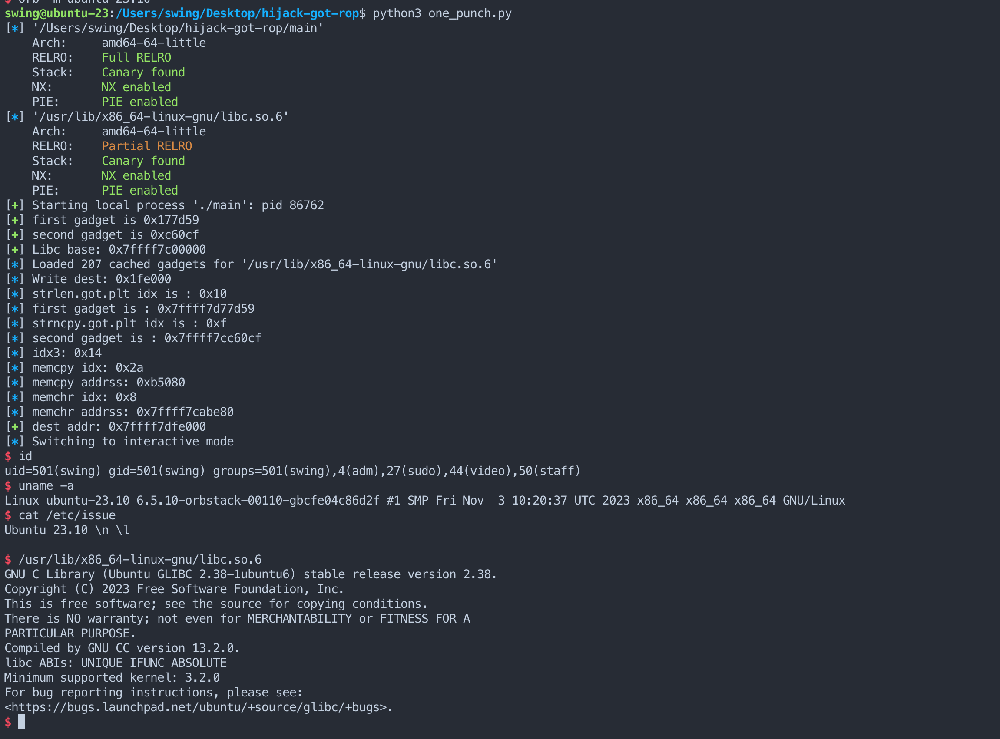

# Glibc > 2.35

This [issue](https://github.com/n132/Libc-GOT-Hijacking/issues/1) mentions the problem that glibc 2.36 and later versions cannot be exploited, due to the GOT (Global Offset Table) headers in libc no longer being writable. However, we found that .got.plt in libc is  still writable, hence we have the following method (verified on glibc 2.36 / 2.37 / 2.38).

# Core Idea

Perform ROP on GOT

# Steps

* Trigger puts, which is in the target function in binary
* The puts function will call `strlen` function, triggering a got entry slot on .got.plt (Assuming the index of `strlen` is 0x10 on .got.plt)
* Overwrite `slot[0x10]`, so we can hijack the program control flow.
* Prepare our first gadget for `slot[0x10]`, it could be `lea rdi, [rsp+24]; ...; call strncpy` since `strncpy` can trigger another slot on `.got.plt`, so we can chain our gadgets.
* Prepare the second gadget, for the corresponding slot that `strncpy` will trigger, It could be like `call wcschr ; ...; mov rax, rbx; pop rbpx; pop rbp; pob r12; ret`, since we can modify `wcschr`'s slot to gets and nudge the stack to hit our `ROPchain` at the last instruction `ret`.
* While jumping into gets, we send the `ROPchain`. This `ROPchain` will be on the stack since we use the first gadget to modify the RDI register to a stack pointer.
* The left `ROPchain` would be executed and return a shell!

# Exploitation and PoC

You can find the demo [here](../Code/after-glibc-2.35). 

