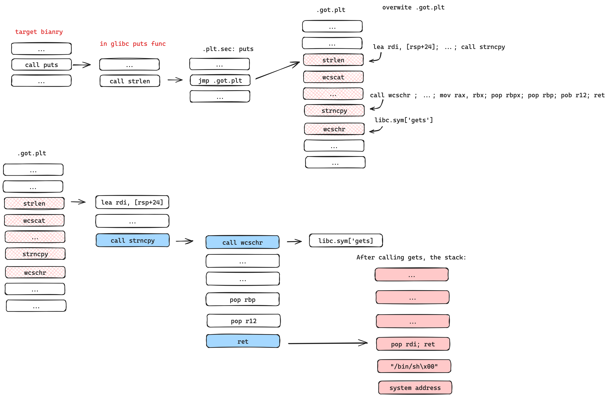

# Libc-GOT-Hijacking

Transform arbitrary write to RCE.

This is a userspace attacking skill: If you can write arbitrary memory space, you can use this method to execute arbitrary code. 

> You only need to know the base addres of glibc

## glibc > 2.35

Comparing glibc<=2.34, there is a mitigation implemented but we desgined a method to bypass it and execute arbitrary code by 
once arbitrary write on Glibc's GOT table. This method performs Return Oriented Programming (ROP) attack on Global Offset Table (GOT). 

You can find details, templates, demos, and everything you want in: [Details][0] and [Templates][3]

## glibc <= 2.35

I learned the orginal method from [Sammy Hajhamid][2] also the methods for glibc <=2.35 are inspired by his work.

Based on his work, We desgined a method to execute arbitrary code by once arbitrary write on Glibc's GOT table. The method uses `PLT_0` to push `libc_exe_address` to the stack and then use `POP RSP, RET` to execute our `ROPchain`.

You can find details, templates, demos, and everything you want in: [Details][1] and [Templates][4]

# Acknowledgments

- Great job [@swing][5] on the impressive work with glibc >2.35!

- Appriciate the original work done by @pepsipu.

# Reference link
- [@pepsipu's Method][2]

[0]: ./Post/README.md
[1]: ./Pre/README.md
[2]: https://hackmd.io/@pepsipu/SyqPbk94a
[3]: ./Post/one_punch.py
[4]: ./Post/templates.md
[5]: https://bestwing.me/